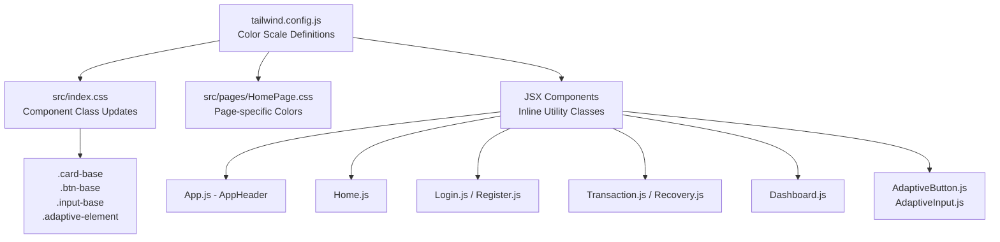

# Design Document: CSS Color Modernization

## Overview

This design covers a color-only CSS modernization of the Behavior-Adaptive-UI React application. The goal is to replace the current basic blue/gray color scheme with a cohesive, modern palette while preserving all existing sizing, layout, adaptive behavior, and JavaScript logic.

The modernization touches four layers:
1. **Tailwind config** (`tailwind.config.js`) — expanded color scales
2. **Global CSS** (`src/index.css`) — component class color updates and body background
3. **Page CSS** (`src/pages/HomePage.css`) — card and button color updates
4. **Inline Tailwind classes** in JSX files — replacing hardcoded color utilities

The current app uses a limited palette: `blue-600`/`blue-700` for primary actions, `gray-*` for text/backgrounds, and scattered `green-600`, `purple-600`, `indigo-600` for secondary actions. The `tailwind.config.js` defines partial scales (only 50/100/500/600/700 for primary, and only 500/600 for others). The modernization will establish complete, intentional color scales and apply them consistently.

### Design Rationale

- **Tailwind-first approach**: All new colors are defined in `tailwind.config.js` so they're available as utility classes. This avoids CSS custom properties or separate design token files, keeping the existing architecture pattern.
- **Color-only constraint**: Every change targets a color-related CSS property (color, background-color, border-color, box-shadow color, gradient stops, opacity for disabled states). No padding, margin, width, height, font-size, or border-radius values are modified.
- **Adaptive compatibility**: The adaptive system (`uiVariants.js`) controls sizing classes (`px-*`, `py-*`, `text-*`, `p-*`, `gap-*`, `rounded-*`, `shadow-*`, `font-*`, `leading-*`). Our color changes use different utility class namespaces (`bg-*`, `text-*` for color, `border-*` for color, `ring-*`, `from-*`/`to-*`/`via-*`) that don't conflict with the dynamic sizing classes. The one overlap is `shadow-*` levels in `uiVariants.js` — we will use `shadow-{color}` modifiers rather than changing shadow levels.

## Architecture

The color modernization follows a top-down propagation model:



### Change Scope

| File | Change Type |
|------|-------------|
| `tailwind.config.js` | Expand color scales (primary 50-900, accent, success, warning, danger with light/base/dark + extra shades) |
| `src/index.css` | Body background color, `.card-base` border/shadow colors, `.input-base` focus ring/border colors, `.btn-base` color properties |
| `src/pages/HomePage.css` | Card background-color, button background-color/hover, header text color |
| `src/App.js` | Navigation bar background/border/backdrop colors, link hover/active colors, metrics card background colors |
| `src/pages/Home.js` | Hero gradient colors, CTA button colors, feature card colors, footer colors |
| `src/pages/Login.js` | Link colors, spinner border colors |
| `src/pages/Register.js` | Link colors, spinner border colors |
| `src/pages/Transaction.js` | Status badge colors, service card hover border color |
| `src/pages/Recovery.js` | Info box background colors, method card colors |
| `src/pages/Dashboard.js` | Tab active colors, metric value colors, action button colors |
| `src/components/AdaptiveButton.js` | Default button background/hover colors |
| `src/components/AdaptiveInput.js` | No changes needed (colors come from `.input-base`) |

### Files NOT Modified

All JavaScript logic files are excluded:
- `src/adaptation/*` (UIContext.js, useUIVariants.js, uiVariants.js, applyAction.js, personaActionMapper.js, actionSpace.js)
- `src/hooks/*` (useMouseTracker.js, useIdleTimer.js, useScrollDepth.js)
- `src/logging/*`, `src/persona/*`, `src/utils/*`
- `src/components/AdaptiveText.js`, `src/components/AdaptiveShowcase.js`, `src/components/AdaptationDebugger.js`, `src/components/MetricsExportPanel.js`

## Components and Interfaces

### 1. Color Palette Definition (tailwind.config.js)

The expanded palette in `tailwind.config.js` will define:

```javascript
colors: {
  primary: {
    50: '#eef2ff',   // Lightest tint (backgrounds, hover states)
    100: '#e0e7ff',  // Light tint (active backgrounds)
    200: '#c7d2fe',  // Soft accent
    300: '#a5b4fc',  // Medium-light
    400: '#818cf8',  // Medium
    500: '#6366f1',  // Base primary (indigo-based)
    600: '#4f46e5',  // Dark primary (buttons, links)
    700: '#4338ca',  // Darker (hover states)
    800: '#3730a3',  // Deep
    900: '#312e81',  // Deepest (text on light backgrounds)
  },
  accent: {
    light: '#dbeafe',
    DEFAULT: '#3b82f6',
    dark: '#1d4ed8',
  },
  success: {
    light: '#d1fae5',
    DEFAULT: '#10b981',
    dark: '#059669',
  },
  warning: {
    light: '#fef3c7',
    DEFAULT: '#f59e0b',
    dark: '#d97706',
  },
  danger: {
    light: '#fee2e2',
    DEFAULT: '#ef4444',
    dark: '#dc2626',
  },
}
```

**Rationale**: The current primary is a sky-blue (`#0ea5e9`). The modernized palette shifts to an indigo-based primary (`#6366f1`) which provides better contrast, feels more professional, and differentiates interactive elements more clearly from informational blue text. The accent scale (blue) serves as a secondary interactive color. Semantic colors (success, warning, danger) retain their hue families but gain a `light` variant for background tinting.

### 2. Navigation Bar (AppHeader in App.js)

Current state:
- `bg-white` background, `border-b border-gray-200`
- Links: `text-gray-700 hover:bg-gray-100`
- Dashboard link: `text-blue-600 hover:bg-blue-50`
- Metrics cards: `bg-gray-50`

Modernized state:
- Frosted-glass: `bg-white/80 backdrop-blur-md` with `border-b border-primary-100`
- Links: `text-gray-700 hover:bg-primary-50 hover:text-primary-700` with `transition-colors duration-200`
- Active link (Dashboard): `text-primary-600 bg-primary-50`
- Metrics cards: `bg-primary-50/50 border border-primary-100`

### 3. Card Component (.card-base in index.css)

Current state:
- `bg-white rounded-lg shadow-md hover:shadow-lg p-6`

Modernized state:
- `bg-white rounded-lg shadow-sm shadow-gray-200/50 border border-gray-100 hover:shadow-md hover:shadow-gray-300/50 p-6`
- Adds subtle border for definition and colored shadow for depth

### 4. Form Elements

**Input (.input-base)**:
Current: `border-gray-300 focus:ring-blue-500`
Modernized: `border-gray-200 focus:ring-primary-500/30 focus:border-primary-500` with `transition-colors duration-150`

**Button (.btn-base / AdaptiveButton)**:
Current: `bg-blue-600 hover:bg-blue-700`
Modernized: `bg-primary-600 hover:bg-primary-700` (gradient optional: `bg-gradient-to-r from-primary-600 to-primary-500`)
Disabled: `opacity-50 cursor-not-allowed` (already partially handled, ensure consistency)

### 5. Body Background

Current: `background-color: #f8fafc` (flat slate-50)
Modernized: `background: linear-gradient(135deg, #f8fafc 0%, #eef2ff 50%, #f8fafc 100%)` — a subtle warm tint using the primary-50 color

### 6. HomePage.css Updates

Current card: `background-color: #f7f8fa`
Modernized: `background-color: #fafbff` (very light primary tint) with `border: 1px solid #e0e7ff`

Current button: `background-color: #4f46e5` (already close to new primary-600)
Keep as-is since it aligns with the new palette.

## Data Models

No data models are affected by this change. The modernization is purely presentational. All data structures in the adaptation system, metrics collection, persona classification, and logging remain unchanged.

The only "data" relevant to this design is the color token mapping:

| Token | Current Value | New Value | Usage |
|-------|--------------|-----------|-------|
| Primary base | `#0ea5e9` (sky) | `#6366f1` (indigo) | Buttons, links, focus rings |
| Primary hover | `#0284c7` | `#4f46e5` | Button hover, link hover |
| Primary light | `#f0f9ff` | `#eef2ff` | Backgrounds, hover states |
| Body background | `#f8fafc` flat | `#f8fafc → #eef2ff` gradient | Page background |
| Card border | none | `#e5e7eb` (gray-200) | Card boundaries |
| Card shadow | `shadow-md` (gray) | `shadow-sm` + colored shadow | Card depth |
| Input focus | `ring-blue-500` | `ring-primary-500/30` | Input focus state |
| Nav background | `bg-white` | `bg-white/80 backdrop-blur-md` | Frosted glass nav |


## Correctness Properties

*A property is a characteristic or behavior that should hold true across all valid executions of a system — essentially, a formal statement about what the system should do. Properties serve as the bridge between human-readable specifications and machine-verifiable correctness guarantees.*

### Property 1: Color scale completeness

*For any* required color scale in the Tailwind config (primary, accent, success, warning, danger), the scale SHALL contain at least the minimum required number of shade entries — primary must have shades 50 through 900 (10 entries), and accent/success/warning/danger must each have at least 3 entries (light, DEFAULT, dark). Each entry must be a valid CSS color string.

**Validates: Requirements 1.1, 1.2**

### Property 2: Button hover shade progression

*For any* button element using a `bg-primary-{N}` base color class, the corresponding hover class should be `hover:bg-primary-{N+100}`, ensuring the hover state is exactly one shade darker than the base state. This applies to all buttons across all pages that use the primary color scale.

**Validates: Requirements 4.2**

### Property 3: Component class preservation

*For any* of the four Tailwind component classes (`adaptive-element`, `btn-base`, `input-base`, `card-base`), the class must remain defined in `index.css` after modernization and must still include transition-related properties (`transition-all`, `duration-*`, or equivalent), ensuring the adaptive system's animation behavior is preserved.

**Validates: Requirements 5.1**

### Property 4: Color-only CSS changes

*For any* CSS property that is added or modified in the modernization, the property must belong to the set of color-related properties: `color`, `background-color`, `background` (gradient), `border-color`, `box-shadow` (color component), `outline-color`, `ring-color`, `opacity`, `backdrop-filter`, `--tw-shadow-color`, `--tw-ring-color`. No sizing properties (`padding`, `margin`, `width`, `height`, `font-size`, `border-radius`, `gap`, `max-width`, `min-width`, `max-height`, `min-height`, `line-height`) shall be added or modified.

**Validates: Requirements 5.2, 5.6**

### Property 5: Protected file integrity

*For any* JavaScript file in the protected set (`src/adaptation/*.js`, `src/hooks/*.js`, `src/logging/*.js`, `src/persona/*.js`, `src/utils/*.js`), the file content must remain identical before and after the modernization. No additions, deletions, or modifications to these files are permitted.

**Validates: Requirements 5.4, 5.5**

## Error Handling

This modernization is purely presentational and introduces no new runtime error paths. However, the following concerns should be addressed:

1. **Invalid Tailwind classes**: If a color utility class references a shade not defined in the config (e.g., `bg-primary-350`), Tailwind will silently ignore it and the element will have no background color. All color utility classes used in JSX must reference shades that exist in the config.

2. **Backdrop-filter browser support**: The `backdrop-blur-md` class used for the frosted-glass navigation bar is not supported in older browsers (IE11, older Firefox). The `bg-white/80` provides a graceful fallback — the nav will appear as a semi-transparent white without the blur effect.

3. **Shadow color utilities**: Tailwind's `shadow-{color}` utilities require Tailwind CSS v3.1+. The project uses `tailwindcss` from `node_modules`, which should be verified to be v3.1+ before using colored shadow utilities. If not available, fall back to standard `shadow-sm`/`shadow-md` without color modifiers.

4. **Class conflict with adaptive system**: The `uiVariants.js` applies `shadow-*` level classes dynamically. Our color changes should use `shadow-{color}` modifiers (e.g., `shadow-gray-200/50`) which set the shadow color but not the shadow level, avoiding conflicts. If both are applied, the level from `uiVariants.js` takes precedence for size, and our color modifier sets the hue.

## Testing Strategy

### Unit Tests

Unit tests should verify specific examples and edge cases:

- **Tailwind config structure**: Verify the config exports the expected color keys and that each value is a valid hex color or CSS color string.
- **Component class existence**: Parse `index.css` and verify `.adaptive-element`, `.btn-base`, `.input-base`, `.card-base` selectors exist.
- **Body background change**: Verify the body CSS no longer uses the flat `#f8fafc` and instead uses a gradient or tinted value.
- **Navigation frosted-glass classes**: Render `AppHeader` and verify the header element contains `backdrop-blur` and semi-transparent background classes.
- **Disabled button styling**: Render a disabled `AdaptiveButton` and verify it has `opacity-50` and `cursor-not-allowed` classes or equivalent styles.
- **No protected file modifications**: Snapshot or checksum all files in `src/adaptation/`, `src/hooks/`, `src/logging/`, `src/persona/`, `src/utils/` and verify they are unchanged.

### Property-Based Tests

Property-based tests should use **fast-check** (JavaScript PBT library, compatible with Jest which this project uses via react-scripts).

Each property test should run a minimum of 100 iterations and be tagged with the corresponding design property.

- **Feature: css-modernization, Property 1: Color scale completeness** — Generate random color scale names from the required set, look them up in the config, and verify minimum shade count and valid color format.
- **Feature: css-modernization, Property 2: Button hover shade progression** — Generate random primary shade numbers (100-800), construct the expected base and hover class pair, and verify the hover shade is base + 100. Scan JSX files to extract actual bg-primary-N / hover:bg-primary-N pairs and verify the relationship holds.
- **Feature: css-modernization, Property 3: Component class preservation** — Generate random selections from the four component class names, parse the CSS, and verify each selected class exists with transition properties.
- **Feature: css-modernization, Property 4: Color-only CSS changes** — Generate random CSS property names from a comprehensive list, classify each as color-related or sizing-related, and verify that only color-related properties appear in the diff of modified CSS files.
- **Feature: css-modernization, Property 5: Protected file integrity** — Generate random file paths from the protected directories, compute checksums before and after, and verify equality.
